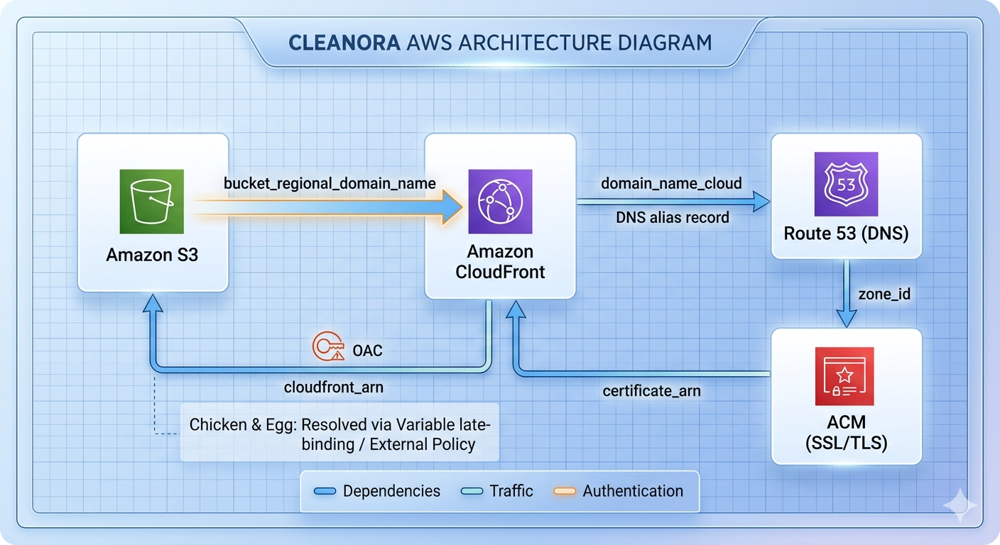

# 🌐 AWS Static Website Infrastructure (S3 + CloudFront + Terraform)

## 📌 Overview

This project provisions a production-ready static website infrastructure on AWS using Terraform. It combines Amazon S3 for storage and CloudFront as a CDN layer, following best practices for security and scalability.
## 🌍 Live Demo 🚀
The project is live here 👉 d1jskvl1ulsdp8.cloudfront.net

This project provisions a **full production-grade AWS infrastructure** using Terraform with a complete CI/CD pipeline.
# 🏗️ Architecture Diagram
<p align="center">
  
</p>
---
---

## 🏗️ Architecture

The infrastructure consists of:

* **S3 Bucket** → Stores static website files
* **CloudFront Distribution** → Delivers content globally with caching
* **Origin Access Control (OAC)** → Restricts direct access to S3
* **Bucket Policy** → Allows only CloudFront to access S3
* *(Optional)* ACM Certificate for HTTPS
* *(Optional)* Route53 for custom domain

---

## 🔄 Architecture Flow

1. User requests website via CloudFront
2. CloudFront fetches content from S3
3. S3 only allows requests from CloudFront (secured via policy)
4. Content is cached globally for performance

---

## 📁 Project Structure

```
.
├── environments/
│   └── dev/
│       └── main.tf
├── modules/
│   ├── s3/
│   ├── cloudfront/
│   ├── acm/          # optional
│   └── dns/          # optional
└── README.md
```

---

## ⚙️ Modules

### 1. S3 Module

Creates:

* S3 bucket
* Static file hosting setup

### 2. CloudFront Module

Creates:

* CloudFront distribution
* Origin pointing to S3
* Caching behavior

### 3. ACM Module *(Optional)*

* Creates SSL certificate (must be in us-east-1)

### 4. DNS Module *(Optional)*

* Creates Route53 records

---

## 🚀 Usage

### 1. Initialize Terraform

```
terraform init
```

### 2. Plan

```
terraform plan
```

### 3. Apply

```
terraform apply
```

---

## 🔐 Security Best Practices

* S3 bucket is **not public**
* Access is restricted using **CloudFront OAC**
* Bucket policy allows only CloudFront ARN

---

## 🧩 Key Configuration Example

```hcl
module "s3" {
  source = "../../../modules/s3"
}

module "cloudfront" {
  source = "../../../modules/cloudfront"
  s3_domain_name = module.s3.bucket_regional_domain_name
}
```

---

## ⚠️ Important Notes

* Avoid circular dependencies between modules
* ACM certificates must be created in **us-east-1** for CloudFront
* Ensure correct bucket policy linking CloudFront ARN

---

## 📈 Future Improvements

* CI/CD pipeline using GitHub Actions
* Automated deployment of static files
* Multi-environment setup (dev/stage/prod)
* Logging & monitoring (CloudWatch + S3 logs)

---

## 👨‍💻 Author

Ahmed Wael

---

## 📄 License

This project is for learning and demonstration purposes.
